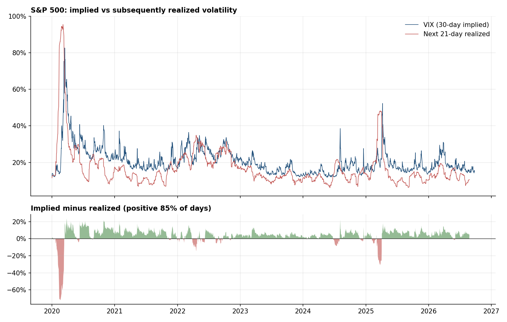
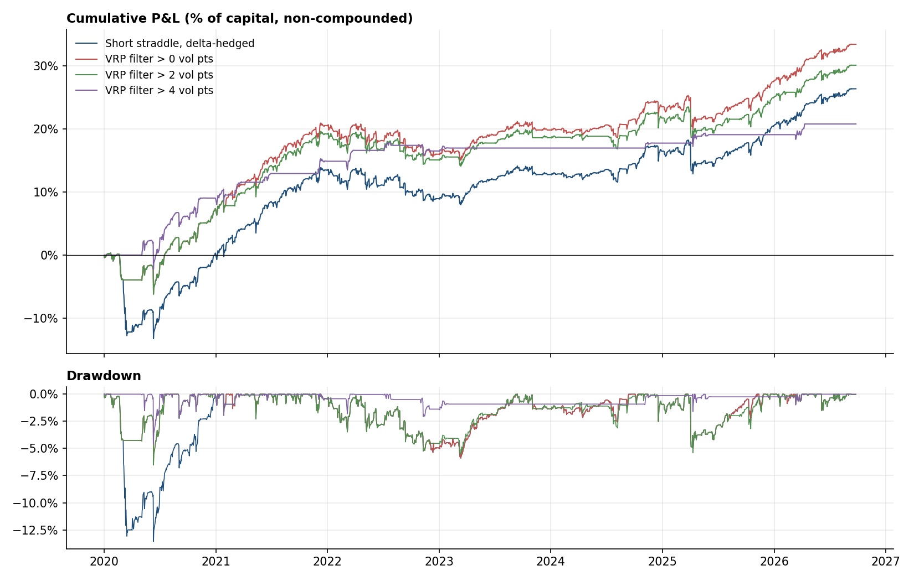
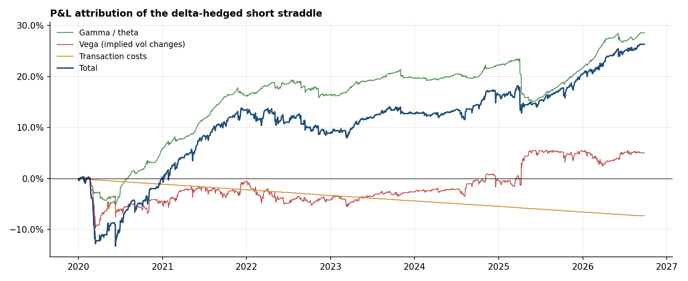
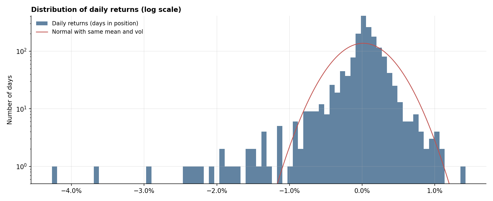

# Volatility Risk Premium on the S&P 500

S&P 500 options are usually priced at an implied volatility above the volatility the index then delivers. This project measures that gap over 2020-2026, checks whether it can be forecast, and backtests a delta-hedged short straddle that tries to collect it, with the emphasis on what happens in the tails.

Everything runs from one command on daily data for the S&P 500 (`^GSPC`) and the VIX (`^VIX`). The evaluation window is **January 2020 to September 2026** (1,692 trading days, 80 monthly trades). The forecasting models are trained on data back to 1990, but only ever on information available at the time.

## Questions

1. How large and how persistent is the gap between the VIX and subsequent realized volatility?
2. Do HAR and GARCH models forecast 21-day realized variance better than the VIX itself, out of sample?
3. What does a systematic, delta-hedged short straddle earn after transaction costs, and what does it lose in a crisis?
4. Does a forecast-based filter (sell only when implied vol exceeds forecast vol by a margin) improve risk-adjusted returns?

## Main findings

The numbers below come from the run stored in [`results/`](results/), on data up to 2026-09-25.

- **The premium is there, and it is uneven.** Over the window the VIX averaged 20.8% against 16.9% of realized volatility over the following 21 days, a gap of 3.8 vol points. The VIX was above what followed on 85% of days. The exceptions are the ones that matter: February-March 2020 (72 vol points below at the worst) and April 2025.
- **The VIX is hard to beat as a forecast.** It has the lowest squared error and the lowest QLIKE of the four models. HAR-X (HAR plus VIX²) and HAR are slightly better in RMSE on volatility (9.6 and 10.0 vs 10.2 vol points) and much less biased, but GARCH(1,1)-t is behind the VIX on every loss function.
- **Delta-hedging is what makes the trade viable.** The hedged short straddle returns 3.9% a year on capital with 5.6% volatility (Sharpe 0.70). The same position unhedged earns nothing (Sharpe 0.00) with more than twice the volatility.
- **The return profile is the usual one.** Skew is -3.8, the worst month is -8.3%, the maximum drawdown is -13.6%, and the Covid crash alone cost 11.1% of capital.
- **The forecast filter helps, but the evidence is thin.** Trading only when `VIX - HAR-X forecast > 0` lifts the Sharpe ratio to 0.97 and halves the drawdown to -6.5%. Almost all of that comes from skipping the February 2020 entry: the filter still trades 78 of the 80 months. Its Deflated Sharpe Ratio is 0.86, which is suggestive but not conclusive with one very large crisis in the sample.
- **One assumption dominates the result.** The backtest needs an at-the-money implied vol and only has the VIX, so it uses `VIX - 2 points`. Moving that to `VIX - 4` turns +3.9% a year into -1.3%; using the raw VIX gives +9.2%.

### Strategies

| strategy | ann. return | ann. vol | Sharpe | max drawdown | worst month | skew | CVaR 99% | months traded | PSR (vs 0) | deflated Sharpe |
|---|---|---|---|---|---|---|---|---|---|---|
| Short straddle, delta-hedged | 3.9% | 5.6% | 0.70 | -13.6% | -8.3% | -3.79 | 2.2% | 80 | 0.95 | 0.69 |
| Short straddle, unhedged | 0.0% | 13.1% | 0.00 | -24.2% | -9.0% | -1.18 | 4.1% | 80 | 0.50 | 0.10 |
| VRP filter > 0 vol pts | 5.0% | 5.1% | 0.97 | -6.5% | -3.0% | -3.86 | 2.0% | 78 | 0.99 | 0.86 |
| VRP filter > 2 vol pts | 4.5% | 5.0% | 0.89 | -6.5% | -3.0% | -4.06 | 2.0% | 68 | 0.98 | 0.82 |
| VRP filter > 4 vol pts | 3.1% | 3.2% | 0.98 | -4.6% | -1.2% | -7.22 | 1.2% | 19 | 0.98 | 0.84 |

Returns are measured on a fixed capital of 1,000,000 with a notional equal to capital, and the P&L is not compounded. The other tables (forecast evaluation, sensitivity, stress episodes) are in [`results/summary.md`](results/summary.md).






## Method

**Data.** Daily closes for `^GSPC` and `^VIX`, downloaded with `yfinance` and cached in `data/`. Local CSV files are also supported.

**Realized volatility.** Forward 21-day realized variance, annualized, from daily log returns:

```
RV(t, t+21) = 252 / 21 * sum_{i=1..21} r(t+i)^2
```

**Forecasting models**, all estimated walk-forward on the data available at the time (HAR refit every 21 days, GARCH every 63):

- HAR (Corsi, 2009): regression of forward variance on daily, weekly and monthly realized variance.
- HAR-X: HAR plus VIX² as an extra regressor.
- GARCH(1,1) with Student-t innovations, 21-day average variance forecast.
- VIX² used directly as a forecast.

Forecasts are compared with RMSE, QLIKE (robust to noise in the realized variance proxy, see Patton 2011) and Mincer-Zarnowitz regressions. A unit test checks that changing future returns leaves past forecasts untouched.

**Strategy.** Every 21 trading days, sell an at-the-money straddle with 21 trading days to expiry on a notional equal to capital, hold it to expiry, and rebalance the delta hedge daily with the index. No position is opened if a full maturity does not fit in the remaining data.

- Pricing: Black-Scholes, marked daily at the prevailing implied vol.
- ATM implied vol proxy: VIX minus 2 vol points. The VIX is computed across the whole strike range and sits above ATM vol because of the put skew, so the raw VIX would overstate the premium collected.
- Costs: option half-spread of 0.25 vol points on entry, 1 bp on every hedge trade.
- P&L attribution: vega P&L from implied vol moves, and gamma/theta P&L from the gap between realized and implied variance.

Variants: an unhedged straddle, and filters that only trade when `VIX - forecast vol` exceeds 0, 2 or 4 vol points.

**Evaluation.** Sharpe, Sortino, maximum drawdown, skew, VaR and CVaR, worst month, a table of ten stress episodes from the Covid crash to March 2026, and the Probabilistic and Deflated Sharpe Ratios (Bailey and López de Prado, 2012, 2014), which account for fat tails and for the five variants tested.

## Limitations

- The VIX is a proxy for ATM implied vol, not a traded price. The sensitivity table shows how much the result depends on that spread; it is the largest single driver of the backtest.
- One implied vol for all strikes and all days in the life of the option: no skew or term-structure dynamics.
- Zero interest rate and dividend yield in pricing, although short rates were around 4-5% for much of 2023-2025.
- Execution at the close with fixed costs. Real spreads widen sharply in stress, which is when the strategy has the most at risk.
- No margin or capital constraints. A real book would have to cut exposure after large losses.
- Six and a half years contain one very large volatility spike (2020) and one large one (2025), so the tail statistics rest on very few events.
- The last month of the sample has no realized outcome yet, so the premium statistics stop in August 2026.

## Project structure

```
vrp/
  data.py         market data download, caching and CSV loading
  volatility.py   realized variance, HAR and GARCH walk-forward forecasts, forecast evaluation
  pricing.py      Black-Scholes prices and straddle greeks
  backtest.py     delta-hedged short straddle backtest and VRP signal
  metrics.py      performance, tail risk, PSR / DSR, stress episodes
  plots.py        figures
  report.py       markdown tables
  pipeline.py     command-line entry point that ties the steps together
run.py            shortcut for `python -m vrp`
tests/            pricing vs finite differences, no look-ahead, backtest invariants, data loading
results/          tables, trade list and figures from the latest run
```

## Usage

```bash
pip install -r requirements.txt
python -m vrp
python -m pytest
```

| option | default | meaning |
|---|---|---|
| `--start` | `1990-01-01` | first date of the history used to train the models |
| `--eval-start` | `2020-01-01` | first date of the out-of-sample window |
| `--end` | latest | last date to use |
| `--refresh` | off | download the data again instead of using the cache |
| `--skip-garch` | off | skip GARCH, which makes the run much faster |
| `--source csv --spx-csv PATH --vix-csv PATH` | `yahoo` | use local files |
| `--out` | `results` | output folder |

The published results were produced with `python -m vrp --end 2026-09-25`; a full run takes about 25 seconds. Yahoo's most recent bar can be an unfinished session, which is why the end date is set explicitly.

## References

- Carr, P. and Wu, L. (2009). Variance Risk Premiums. *Review of Financial Studies*.
- Corsi, F. (2009). A Simple Approximate Long-Memory Model of Realized Volatility. *Journal of Financial Econometrics*.
- Bailey, D. and López de Prado, M. (2012). The Sharpe Ratio Efficient Frontier. *Journal of Risk*.
- Bailey, D. and López de Prado, M. (2014). The Deflated Sharpe Ratio. *Journal of Portfolio Management*.
- Patton, A. (2011). Volatility Forecast Comparison Using Imperfect Volatility Proxies. *Journal of Econometrics*.
